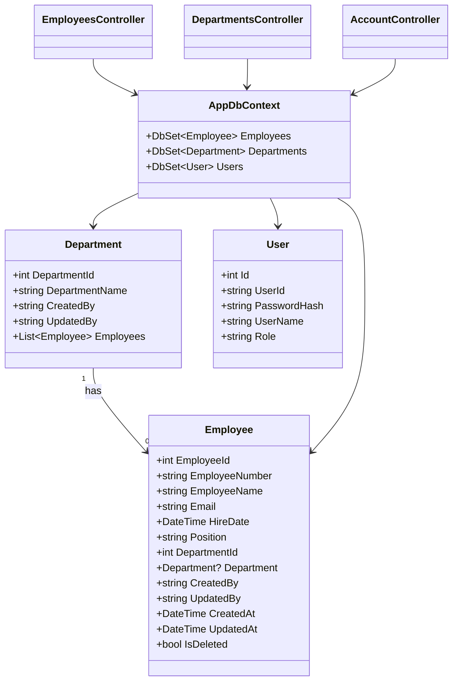

# クラス図

```mermaid
classDiagram
    class Employee {
      +int EmployeeId
      +string EmployeeNumber
      +string EmployeeName
      +string Email
      +DateTime HireDate
      +string Position
      +int DepartmentId
      +Department? Department
      +string CreatedBy
      +string UpdatedBy
      +DateTime CreatedAt
      +DateTime UpdatedAt
      +bool IsDeleted
    }

    class Department {
      +int DepartmentId
      +string DepartmentName
      +string CreatedBy
      +string UpdatedBy
      +List~Employee~ Employees
    }

    class User {
      +int Id
      +string UserId
      +string PasswordHash
      +string UserName
      +string Role
    }

    class AppDbContext {
      +DbSet~Employee~ Employees
      +DbSet~Department~ Departments
      +DbSet~User~ Users
    }

    class EmployeesController
    class DepartmentsController
    class AccountController

    Department "1" --> "0..*" Employee : has
    AppDbContext --> Employee
    AppDbContext --> Department
    AppDbContext --> User
    EmployeesController --> AppDbContext
    DepartmentsController --> AppDbContext
    AccountController --> AppDbContext
```
