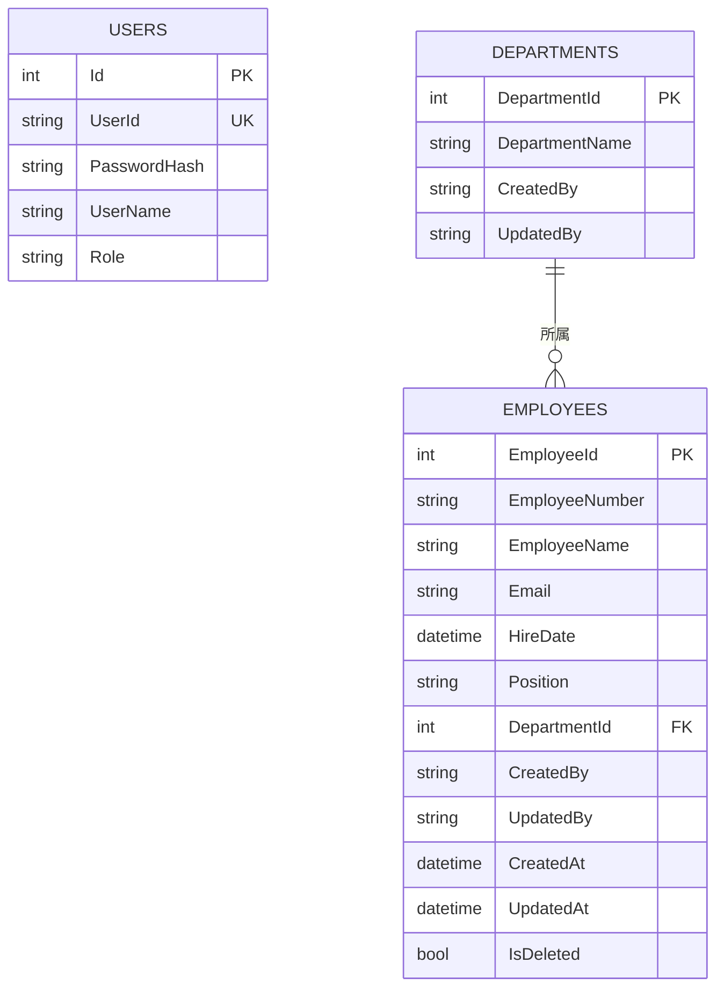

# ER図

```mermaid
erDiagram
    USERS {
        int Id PK
        string UserId UK
        string PasswordHash
        string UserName
        string Role
    }

    DEPARTMENTS {
        int DepartmentId PK
        string DepartmentName
        string CreatedBy
        string UpdatedBy
    }

    EMPLOYEES {
        int EmployeeId PK
        string EmployeeNumber
        string EmployeeName
        string Email
        datetime HireDate
        string Position
        int DepartmentId FK
        string CreatedBy
        string UpdatedBy
        datetime CreatedAt
        datetime UpdatedAt
        bool IsDeleted
    }

    DEPARTMENTS ||--o{ EMPLOYEES : "所属"
```

- `Employees.DepartmentId` は `Departments.DepartmentId` を参照します。
- `Users` はログイン認証とロール判定（Admin/User）に利用します。
- `Employees` は論理削除フラグ `IsDeleted` を持ちます。
