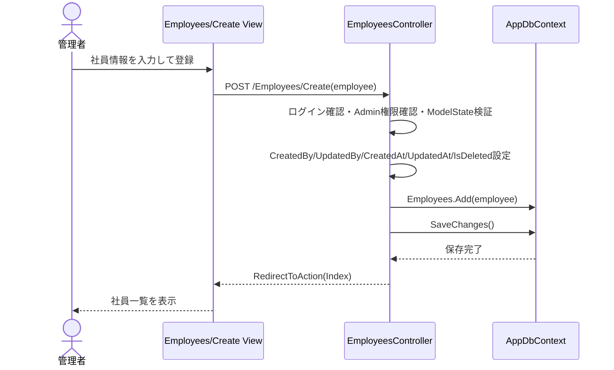
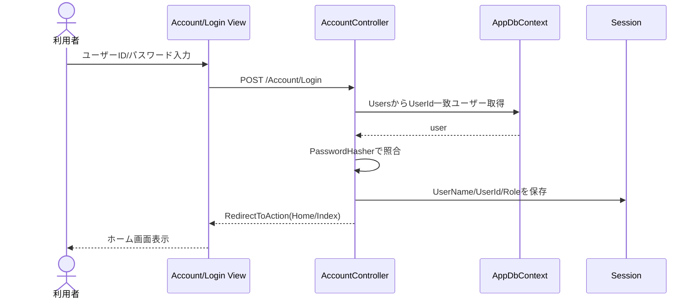

# シーケンス図（正常系のみ）

## 社員登録（Adminユーザー）

```mermaid
sequenceDiagram
    actor U as 管理者
    participant V as Employees/Create View
    participant C as EmployeesController
    participant DB as AppDbContext

    U->>V: 社員情報を入力して登録
    V->>C: POST /Employees/Create(employee)
    C->>C: ログイン確認・Admin権限確認・ModelState検証
    C->>C: CreatedBy/UpdatedBy/CreatedAt/UpdatedAt/IsDeleted設定
    C->>DB: Employees.Add(employee)
    C->>DB: SaveChanges()
    DB-->>C: 保存完了
    C-->>V: RedirectToAction(Index)
    V-->>U: 社員一覧を表示
```

## ログイン

```mermaid
sequenceDiagram
    actor U as 利用者
    participant V as Account/Login View
    participant C as AccountController
    participant DB as AppDbContext
    participant S as Session

    U->>V: ユーザーID/パスワード入力
    V->>C: POST /Account/Login
    C->>DB: UsersからUserId一致ユーザー取得
    DB-->>C: user
    C->>C: PasswordHasherで照合
    C->>S: UserName/UserId/Roleを保存
    C-->>V: RedirectToAction(Home/Index)
    V-->>U: ホーム画面表示
```
